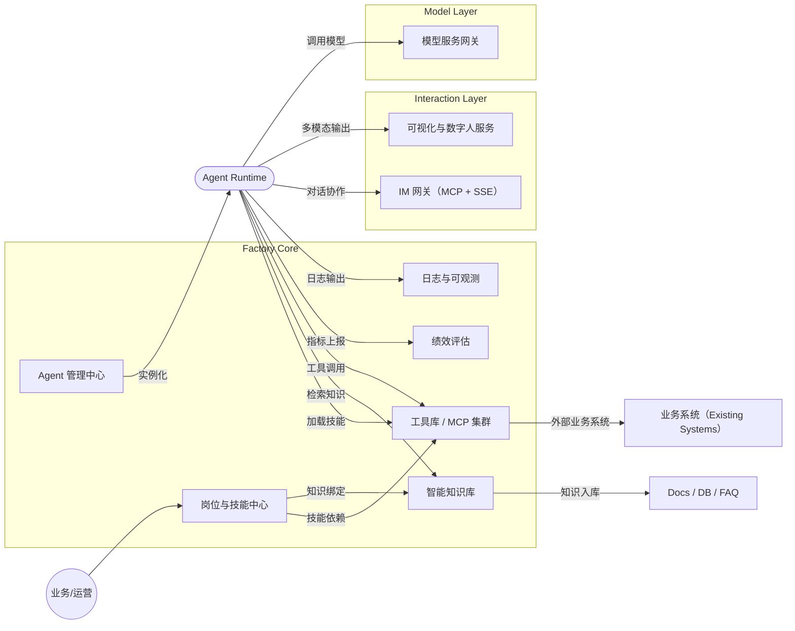
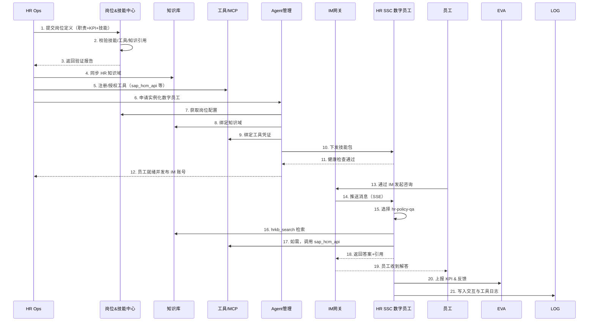

# Digital Crew Factory (DCF) - 总体技术设计

## 1. 背景与意义

### 1.1 时代背景
- 大模型、Agent、MCP 等底层能力日益成熟，智能体已具备上下文理解、工具调用、持久记忆能力。
- 企业需要把 Agent 从“单一功能机器人”升级为“可责任追溯的数字员工”，使其像人一样承担岗位职责、接受绩效考核、持续成长。
- 数字员工能力越多元，企业越能在组织层面重构流程，因此需要“工厂化”方式规模化生产和治理数字员工。

### 1.2 现状痛点
1. 定制开发周期长：每个 Agent 都要重复绑知识、接工具、写 Prompt。
2. 能力难复用：技能散落代码，缺少独立测试与跨项目迁移标准。
3. 缺乏统一语言：岗位、技能、KPI、工具定义不统一，难评估、难合规。
4. 运营不可观测：无法衡量数字员工是否达成 KPI，更谈不上自动成长。

### 1.3 DCF 目标
- 以岗位为基本单位，将数字员工构建拆解为标准化工序。
- 通过 Skill 规范、知识库模板、工具封装实现“能力积木化”。
- 提供微服务基础设施，支持岗位、技能、知识、工具独立演进。
- 让业务人员自助创建、评估、运营数字员工，工程团队聚焦底层服务演化。

### 1.4 关键价值
| 价值面 | 传统方式 | DCF 工厂方式 |
|---|---|---|
| 构建效率 | 6 周/员工，重复造轮子 | 30 分钟拼装，复用能力库 |
| 质量控制 | 依赖经验 | 声明式定义 + 自动验证 |
| 运营可视 | 零散日志 | 全链路日志 + 绩效指标 |
| 规模效应 | 边际成本不降 | 技能/知识/工具复用带来边际递减 |

---

## 2. 核心概念与统一语言

| 名称 | 定义 | 关键属性 | 说明 |
|---|---|---|---|
| Digital Crew / 数字员工 | 可思考、执行、协作的 Agent 个体 | `role_id`、`skill_loadout`、`knowledge_links`、`tool_bindings`、`kpi_contract` | 数字员工应具备岗位身份与绩效约束 |
| Role / 岗位 | 组织中职责范围抽象 | 职责清单、边界、KPI、SOP、技能/工具/知识需求 | 岗位是治理入口 |
| Skill / 技能 | Claude Code Skill 规范能力单元 | `inputs`、`outputs`、`prompt_template`、`required_tools`、`required_knowledge`、`validation` | 可复用、可测试、可组合 |
| Skill Graph | 技能关系图 | 依赖拓扑、版本、兼容性 | 反映成长路径，支持自动装配 |
| Tool / 工具 | 原子化执行接口（API/SaaS/内部系统） | Schema、治理策略、权限、调用日志 | 通过 MCP/MCP-like Server 封装 |
| Knowledge Vault / 知识库 | 企业私有知识统一载体 | 知识域、数据血缘、检索策略、质量指标 | 为 Agent 注入领域上下文 |
| MCP Gateway | 面向 Agent 的多协议工具网关 | 工具注册、认证、SSE 交互 | 统一封装外部系统、IM、模型服务 |
| Agent Runtime | 数字员工运行时大脑 | 记忆、推理、ReAct、Plan、自我反思 | 需支持 Skill 生命周期管理 |
| Evaluation & Growth | 评估与成长体系 | 绩效指标、技能掌握度、学习计划 | 形成岗位合格与成长闭环 |

> 默认使用 Claude Code Skill 定义，便于在 IDE/CLI 中编辑、测试、复用。

---

## 3. 系统架构

### 3.1 设计原则
- 岗位中心：围绕“岗位 -> 技能 -> 工具/知识”组织，资产均具备版本、权限与评估。
- 声明式与可验证：岗位、技能、知识、工具使用 YAML/JSON 声明并自动校验。
- 微服务解耦：Role/Skill、知识、Agent 管理、IM 网关、模型网关等服务独立演进。
- MCP 优先：可交互服务尽量以 MCP Server 形式暴露，便于生态复用。
- 治理内建：日志、审计、权限、性能指标从 Day 1 纳入设计。

### 3.2 逻辑架构


### 3.3 核心微服务
1. 岗位与技能中心
- 职责：定义与版本化岗位，维护岗位-技能映射，管理技能图谱与依赖。
- 能力：Skill 注册/组合/测试、岗位合规检查、KPI 模板、自助配置 API。

2. 智能知识库
- 职责：统一文档/数据库 ingest，自动分类打标，构建向量索引。
- 能力：多知识域治理、版本追踪、质量指标、RAG API 与 MCP Server。

3. 工具库与外部系统 MCP 集群
- 职责：封装内部系统与第三方 API，统一认证与权限、调用审计。
- 能力：工具声明（Schema/治理/权限）、调用执行、错误隔离、限流。

4. IM 网关
- 职责：抽象飞书、Matrix、金山等 IM 接入，支持消息、文件、群聊、SSE。
- 能力：统一消息模型、事件订阅、对话上下文持久化。

5. 模型服务网关
- 职责：统一管理 LLM/Embedding/音频/多模态模型，兼容 OpenAI 协议。
- 能力：模型路由、A/B 测试、监控对比、成本优化。

6. 可视化/数字人服务
- 职责：数字形象渲染、动作表情控制、富文本图表输出、ASR/TTS 管道。

7. 日志与观测
- 职责：统一日志、事件、指标、审计，支撑问题定位与安全合规。

8. Agent 管理中心
- 职责：生成/托管 Agent，管理运行状态、记忆、心跳，快速纳管外部 Agent。
- 能力：实例化流程、配置下发、监控告警、自愈策略。

9. 绩效评估与成长
- 职责：采集 KPI 与技能评估，输出绩效报告并触发学习升级流程。

### 3.4 技术落地建议
- Agent Runtime：优先 `Claude Agent SDK` 或 `AgentScope`，支持技能热加载、工具封装、MCP 客户端。
- Skill 定义：采用 `.claude/skills/<skill>/skill.md` 或 YAML，配套测试脚本自动验证。
- 知识库：向量数据库（Pinecone/Milvus）+ reranker，支持自动分类与版本追踪。
- 工具封装：通过 MCP Server + gRPC/REST 适配层，工具声明入库并关联权限。
- 可视化：`WebRTC/3D` 渲染 + 富文本渲染 + `ASR/TTS` Pipeline。

---

## 4. 完整示例：HR Shared Service 数字员工

### 4.1 场景描述
- 岗位 1：HR Shared Service（SSC）专员
  - 7×24 响应员工咨询，按 SOP 处理事务，异常升级 HRBP。
- 岗位 2：知识库管理员工
  - 负责 HR 知识域入库、分类、质量监控和版本发布。
- 共用资产：`hrkb_search` MCP 工具、`hr_policy_manual` 知识域、IM 网关账号、统一模型网关。

### 4.2 岗位与技能蓝图

#### 4.2.1 HR Shared Service Specialist
| 项 | 定义 |
|---|---|
| 职责 | 7×24 回复员工咨询、按 SOP 处理工单、识别异常并升级 HRBP |
| KPI | `response_time_p95 < 45s`、`resolution_rate > 92%`、`csat > 4.6`、`escalation_accuracy > 95%` |
| 依赖知识 | `hr_policy_manual`、`benefit_catalog`、`process_sop` |
| 工具 | `hrkb_search`、`sap_hcm_api`、`ticket_system_api`、`case_store_api` |

核心技能：
| Skill | 说明 | 依赖 |
|---|---|---|
| `hr-policy-qa-v2` | HR 政策问答并输出引用 | 工具：`hrkb_search`；知识：`hr_policy_manual` |
| `workflow-tracking-v1` | 查询流程节点并提醒待办 | 工具：`sap_hcm_api`、`ticket_system_api`；知识：`process_sop` |
| `ticket-routing-v1` | 按优先级与权限进行路由分派 | 工具：`ticket_system_api`、`human_escalation_hook` |
| `hr-case-summarizer-v1` | CRM 友好格式总结并回写 | 工具：`case_store_api`；知识：`process_sop` |

#### 4.2.2 知识库管理员工（Knowledge Vault Manager）
| 项 | 定义 |
|---|---|
| 职责 | 入库/清洗 HR 文档，维护标签/版本，运行质量评估并发布通知 |
| KPI | `ingestion_sla < 30m`、`retrieval_precision > 0.9`、`coverage > 95%`、`freshness < 24h` |
| 依赖知识 | `hr_policy_manual`、`benefit_catalog`、`process_sop`（元知识） |
| 工具 | `document_fetcher`、`md_parser`、`vector_index_api`、`kb_metadata_api`、`skill_runner`、`evaluation_service`、`im_gateway` |

核心技能：
| Skill | 说明 | 依赖 |
|---|---|---|
| `doc-ingestion-orchestrator-v1` | 抓取、清洗、切分、入库编排 | `document_fetcher`、`md_parser`、`vector_index_api` |
| `kb-taxonomy-manager-v1` | 自动分类、打标、维护血缘 | `classification_model`、`kb_metadata_api` |
| `knowledge-quality-guardian-v1` | 运行回归问答与准确率统计 | `skill_runner`、`evaluation_service` |
| `kb-release-notifier-v1` | 生成 Changelog 并同步 IM/邮件 | `im_gateway`、`email_service` |

### 4.3 资产定义摘要

#### `roles/hr-ssc-specialist.yaml`
```yaml
apiVersion: digital-crew/v1
kind: Role
metadata:
  name: hr-ssc-specialist-v1
spec:
  responsibilities:
    - 7x24 回复员工 HR 咨询
    - 根据 SOP 操作流程单
    - 识别异常并升级 HRBP
  kpi_metrics:
    - { name: response_time_p95, target: <45s }
    - { name: resolution_rate, target: >92% }
    - { name: csat, target: >4.6 }
  required_skills:
    - { skill_id: hr-policy-qa-v2, proficiency: expert }
    - { skill_id: workflow-tracking-v1, proficiency: advanced }
    - { skill_id: ticket-routing-v1, proficiency: intermediate }
  required_tools: [hrkb_search, sap_hcm_api, ticket_system_api]
  knowledge_requirements:
    - { domain: hr_policy_manual, coverage: complete }
    - { domain: benefit_catalog, coverage: essential }
  workflows:
    - name: employee-question-flow
      steps: [intent_detect, select_skill, retrieve_kb, call_tool, compose_answer, quality_check]
```

#### `skills/hr-policy-qa/skill.yaml`
```yaml
name: hr-policy-qa-v2
capability:
  input_types: [text]
  output_types: [answer, references]
required_tools:
  - hrkb_search
prompt_template: |
  你是一名 HR 政策专家。遵循以下行为：
  1. 解析员工问题，明确关键词、时间范围、政策类型。
  2. 使用 hrkb_search 检索 3-5 条相关文档片段。
  3. 输出结构化回答，附引用。
validation:
  - input: "产假多少天?"
    expected_tool: hrkb_search(query="产假 天数")
```

#### `roles/knowledge-vault-manager.yaml`
```yaml
apiVersion: digital-crew/v1
kind: Role
metadata:
  name: knowledge-vault-manager-v1
spec:
  responsibilities:
    - 监测新 HR 文档并触发 ingest
    - 维护知识域标签、血缘和版本
    - 每日运行知识质量评估
    - 发布版本更新并通知利益相关人
  kpi_metrics:
    - { name: ingestion_sla, target: <30m }
    - { name: retrieval_precision, target: >0.9 }
    - { name: coverage, target: >95% }
    - { name: freshness, target: <24h }
  required_skills:
    - { skill_id: doc-ingestion-orchestrator-v1, proficiency: expert }
    - { skill_id: kb-taxonomy-manager-v1, proficiency: advanced }
    - { skill_id: knowledge-quality-guardian-v1, proficiency: advanced }
    - { skill_id: kb-release-notifier-v1, proficiency: intermediate }
  required_tools: [document_fetcher, md_parser, vector_index_api, kb_metadata_api, skill_runner, evaluation_service, im_gateway]
  knowledge_requirements:
    - { domain: hr_policy_manual, coverage: steward }
    - { domain: benefit_catalog, coverage: steward }
  workflows:
    - name: daily-ingestion-flow
      steps: [source_scan, doc_ingest, taxonomy_update, regression_test, release_note]
```

#### `skills/doc-ingestion-orchestrator/skill.yaml`
```yaml
name: doc-ingestion-orchestrator-v1
description: 将新文档 ingest 到 hr_policy_manual 知识域
capability:
  inputs:
    - name: source_uri
      type: uri
    - name: document_type
      type: enum[md,pdf,db]
  outputs:
    - name: ingestion_report
      type: json
dependencies:
  tools:
    - document_fetcher
    - md_parser
    - vector_index_api
  knowledge:
    - hr_policy_manual
instructions: |
  1. 校验 source_uri，必要时补充认证信息；
  2. 使用 document_fetcher 下载原文件；
  3. 交由 md_parser 清洗/切分 500/50 chunk；
  4. 调用 vector_index_api 写入 hr_policy_manual 域，并带 metadata（版本、标签、SLA）；
  5. 返回 ingestion_report，总结 chunk 数量、耗时和异常。
evaluation:
  - input:
      source_uri: s3://hr/manuals/new-policy.md
      document_type: md
    expected_tools:
      - document_fetcher
      - md_parser
      - vector_index_api
    asserts:
      - ingestion_report.status == "success"
      - ingestion_report.chunk_count > 0
```

### 4.4 时序图（创建与运行）


### 4.5 运行闭环
- 绩效服务按日/周评估数字员工 KPI，并生成成长任务。
- 若 KPI 不达标，自动触发 Skill Builder 迭代技能或补齐知识域。
- 运营可在 Agent 管理中心查看状态、重训或扩展到新语言/地区。

---

## 5. 风险与挑战

| 风险/挑战 | 描述 | 应对策略 |
|---|---|---|
| 语义与职责对齐 | 岗位职责不清会导致 Agent 行为失控 | 制定岗位建模手册，强制职责/KPI/SOP 模板校验 |
| 技能质量与版本治理 | 多人维护技能易冲突 | Skill Graph + 语义版本 + 自动回归 + 灰度回滚 |
| 知识库时效性 | 过期政策导致错误答复 | 知识域 SLA、自动同步、质量评分、过期告警 |
| 工具接入复杂度 | 系统多、安全策略严格 | 统一 MCP 网关、细粒度权限、审计日志、沙箱 |
| 模型合规与成本 | 数据出境与成本波动 | 模型网关策略控制、区域隔离、成本监控与 A/B |
| 人机协同体验 | IM/可视化/多模态体验碎片化 | IM 事件模型抽象 + 数字人统一入口 |
| 运营与增长 | 难衡量表现与成长 | 绩效评估 + 成长任务 + Skill Builder 循环 |
| 安全审计 | 数据访问与调用缺追踪 | 全量日志事件留存，支持溯源与审计 |

---

## 6. 技能自动校验最佳实践

建议建立多层自动校验流水线，确保 Claude Code Skill 能稳定复用于岗位与技能中心。

### 6.1 Schema Lint
- 约定 `.claude/skills/<skill>/skill.md` 结构。
- 使用 `JSON Schema/Pydantic` 在 `scripts/validate_skills.py` 校验字段（`capability`、`dependencies`、`evaluation` 等）。
- 作为 pre-commit 和 CI 步骤，未通过禁止合入。

### 6.2 依赖可用性检查
- 脚本读取技能声明，通过岗位与技能中心 API 校验工具/知识域/技能版本及授权。
- 对 MCP 工具执行 `POST /tools/{id}/test` 健康检查。

### 6.3 Golden Test 套件
- 在 `tests/skills/<skill>/cases.yaml` 维护典型输入、期望工具调用、输出断言。
- 提供 CLI：
```bash
python scripts/run_skill_cases.py --skill hr-policy-qa-v2
```
- 依赖 Agent Runtime dry-run 模拟执行，记录成功率与耗时。

### 6.4 模拟运行与可观测
- Agent Runtime 加载技能时开启 dry-run，生成 Prompt/工具序列/token 成本日志。
- 关键指标（成功率、延迟、token 消耗）回传日志服务做回归对比。

### 6.5 回归与成长循环
- 绩效评估服务夜间触发 skill regression（尤其核心技能如 `hr-policy-qa`），统计准确率并关联 KPI。
- 不达标自动创建成长任务：更新 Prompt、补充知识、扩展工具。

### 6.6 合规与安全扫描
- 对 `instructions`、`dependencies` 做敏感信息扫描，校验工具权限与数据分类。
- 记录技能版本与依赖快照，支持审计与回溯。

通过上述流水线，可在提交层拦截结构性问题，在运行层持续监控精度，让业务侧一键查看“是否可上岗”。

---

## 7. 收尾建议
本文档聚焦顶层设计。建议实施节奏：
1. 优先落地岗位/技能中心 + MCP 工具库 + Agent 管理闭环。
2. 再扩展可视化、模型网关、评估系统。
3. 按行业场景打样并形成可复用模板，逐步规模化复制。
