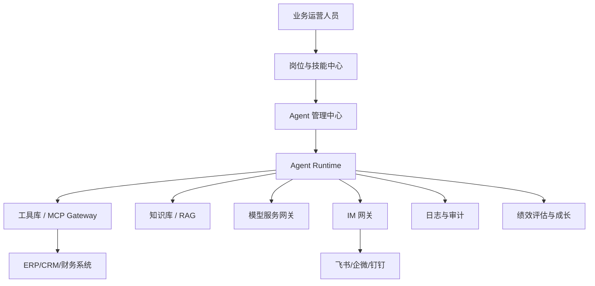

# Digital Crew Factory (DCF) 总体技术设计文档（ClaudeCode版）

## 0. 文档定位
- 目标读者：产品负责人、架构师、平台工程团队、运营与实施团队。
- 使用场景：用于项目立项、架构评审、迭代排期与跨团队协作。
- 版本策略：按里程碑阶段滚动维护（`v1 -> v1.1 -> v2`）。

## 1. 项目目标与边界

### 1.1 核心目标
构建一套“数字员工工厂”（Digital Crew Factory），支持企业以岗位为核心，标准化创建、运行、评估和进化数字员工（Agent）。

### 1.2 非目标
- 不做单一聊天机器人平台。
- 不做仅依赖 Prompt 的轻编排工具。
- 不把数字员工当作不可治理的黑盒能力。

### 1.3 成功标准（MVP）
- 支持岗位建模、技能装配、工具绑定、知识绑定、实例化运行全链路。
- 支持核心指标采集：任务完成率、响应时延、升级准确率、用户满意度。
- 支持技能版本管理与回归测试。

## 2. 统一对象模型

### 2.1 关键对象
| 对象 | 说明 | 核心字段 |
|---|---|---|
| Role | 岗位定义与职责约束 | `id`、`responsibilities`、`kpi_metrics`、`required_skills` |
| Skill | 可复用能力单元 | `name`、`capability`、`dependencies`、`evaluation` |
| Tool | 可调用执行接口 | `tool_id`、`schema`、`auth_policy`、`rate_limit` |
| KnowledgeDomain | 知识域与检索策略 | `domain_id`、`source`、`index_policy`、`quality_score` |
| DigitalCrew | 数字员工实例 | `crew_id`、`role_id`、`skill_loadout`、`runtime_state` |
| EvaluationReport | 绩效评估结果 | `period`、`kpi_result`、`issues`、`growth_actions` |

### 2.2 对象关系
```text
Role -> binds Skills
Role -> requires Tools + KnowledgeDomains
DigitalCrew -> instantiated from Role
DigitalCrew -> emits Logs + KPI
EvaluationReport -> feeds Skill/Knowledge growth loop
```

## 3. 总体架构

### 3.1 分层设计
1. 资产层：岗位、技能、知识、工具。
2. 编排层：Agent 管理、运行时调度、任务路由。
3. 连接层：MCP 网关、IM 网关、模型网关。
4. 治理层：日志、审计、评估、告警、权限。

### 3.2 逻辑图


## 4. 微服务拆分与职责

### 4.1 岗位与技能中心（Role & Skill Center）
- 岗位模板管理、技能注册与依赖校验。
- 对外 API：岗位 CRUD、技能版本发布、装配校验。

### 4.2 知识库服务（Knowledge Vault）
- 文档 ingest、切分、索引、检索与质量监控。
- 对外 API：知识入库、语义检索、版本发布。

### 4.3 工具网关（Tooling / MCP Gateway）
- 统一工具注册、认证、鉴权、调用审计。
- 支持协议：MCP、HTTP、gRPC、WebSocket（按阶段落地）。

### 4.4 Agent 管理中心（Agent Control Plane）
- 实例生命周期管理：创建、配置下发、心跳监控、下线。
- 支持多租户与命名空间隔离。

### 4.5 评估与成长服务（Evaluation & Growth）
- KPI 聚合、异常识别、成长任务生成。
- 输出绩效报告并驱动技能优化。

## 5. 关键流程（端到端）

### 5.1 创建数字员工
1. 提交岗位定义（职责、KPI、技能依赖）。
2. 校验技能、工具、知识依赖是否可用。
3. 绑定权限策略与运行配额。
4. 实例化 Digital Crew 并生成 IM 身份。

### 5.2 任务执行
1. 用户在 IM 发起请求。
2. Runtime 做意图识别与技能选择。
3. 检索知识 + 调用工具。
4. 生成响应并返回引用。
5. 上报日志与 KPI 指标。

### 5.3 绩效与成长闭环
1. 周期性评估 KPI。
2. 不达标触发成长任务（补知识、改技能、调策略）。
3. 回归测试通过后灰度发布新版本。

## 6. 配置规范示例

### 6.1 Role 示例
```yaml
apiVersion: digital-crew/v1
kind: Role
metadata:
  name: hr-ssc-specialist-v1
spec:
  responsibilities:
    - 7x24 回复员工咨询
    - 按 SOP 处理 HR 工单
  kpi_metrics:
    - { name: response_time_p95, target: <45s }
    - { name: resolution_rate, target: >92% }
  required_skills:
    - { skill_id: hr-policy-qa-v2, proficiency: expert }
  required_tools: [hrkb_search, ticket_system_api]
```

### 6.2 Skill 示例
```yaml
name: hr-policy-qa-v2
capability:
  input_types: [text]
  output_types: [answer, references]
dependencies:
  tools: [hrkb_search]
  knowledge: [hr_policy_manual]
instructions: |
  1. 识别问题中的政策主题和时间范围
  2. 检索相关文档片段
  3. 输出结论并附引用
```

## 7. 工程落地计划

### 7.1 里程碑 M1（4-6 周）
- 完成岗位/技能中心 MVP。
- 完成知识库 ingest + 检索 MVP。
- 完成工具网关基础能力（注册、鉴权、调用日志）。

### 7.2 里程碑 M2（6-8 周）
- 完成 Agent 管理中心与 Runtime 打通。
- 打通 IM 网关（先飞书或企微之一）。
- 接入绩效评估服务，输出首版 KPI 看板。

### 7.3 里程碑 M3（8-12 周）
- 完成技能自动回归与灰度发布机制。
- 完成多租户、审计、权限增强。
- 形成行业模板（HR、客服、财务至少 1 个）。

## 8. 质量与治理

### 8.1 自动校验
- Skill Schema Lint
- 依赖可用性检查（工具、知识域、权限）
- Golden Cases 回归测试

### 8.2 可观测性
- 指标：成功率、延迟、token 成本、工具调用失败率。
- 日志：对话轨迹、工具调用链、知识引用链。
- 告警：KPI 连续下滑、工具异常、知识域过期。

### 8.3 安全与合规
- 细粒度权限控制（工具级、知识域级、岗位级）。
- 全链路审计日志可追溯。
- 数据分级治理与敏感信息扫描。

## 9. 风险与应对
| 风险 | 说明 | 应对 |
|---|---|---|
| 角色定义不清 | 数字员工行为漂移 | 角色模板 + 强制 KPI/SOP 校验 |
| 知识过期 | 输出错误结论 | 知识 SLA + 定时评估 + 过期告警 |
| 工具不稳定 | 任务失败率上升 | 熔断/降级/重试 + 沙箱联调 |
| 成本失控 | 模型调用费用波动 | 模型网关路由 + 配额与预算控制 |

## 10. 结论
DCF 的本质不是“做更多 Agent”，而是建立“可规模化生产、可治理运营、可持续成长”的数字员工体系。建议先以一个高价值场景（如 HR SSC）做标准化样板，再按统一对象模型与微服务边界向多场景复制。
